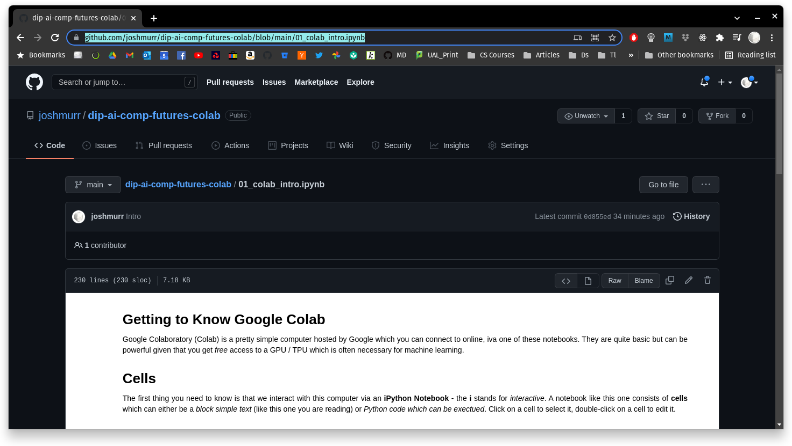
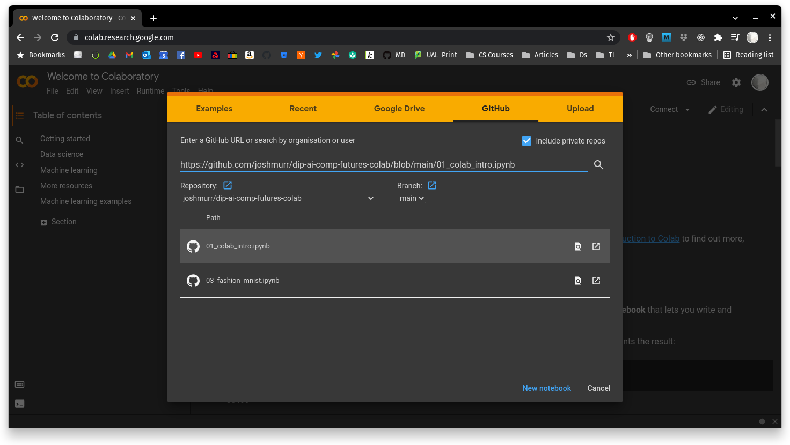

# How to open these notebooks in Colab

Open one of the notebooks here on Github (notebooks are files that end in `.ipynb`) and copy the URL:

Then go to [**colab.research.google.com**](colab.research.google.com) and click on the **Github** tab. Paste the URL into the search bar and then **click on the magnifiying glass**:

