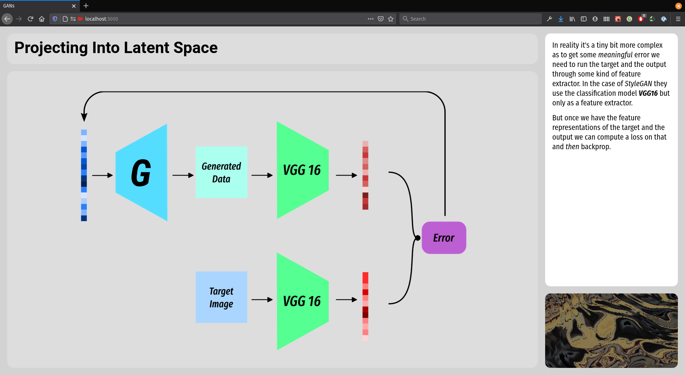
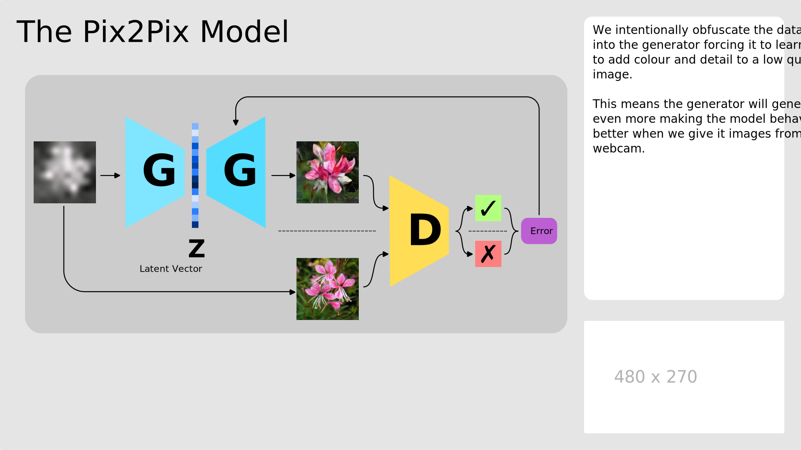

# GANs - Generative Adversarial Networks

> Remember for all the notebooks below you need to copy the link and open it up in [colab.research.google.com](colab.research.google.com) as per the instructions [on this page](https://github.com/joshmurr/dip-ai-comp-futures-colab).

---

# 1. DCGAN - Deep Convolutional GAN

[Train a small DCGAN using Keras on the Celeb-A dataset.](https://github.com/joshmurr/machine-learnings/blob/master/cci-dsai/DCGAN_Keras.ipynb)

[Train a similar DCGAN on your own dataset created using a YouTube video](https://github.com/joshmurr/machine-learnings/blob/master/cci-dsai/DCGAN_Keras_Cutsom_Dataset.ipynb)

# 2. __TASK!__ - StyleGAN

StyleGAN is a household name in the machine learning world. It really made a name for itself by being the first model to make extremely convincing, relatively high resolution images of human faces (and pretty much anything else). This stoked the _how-will-we-ever-trust-an-image-again?!_ fire. Regardless StyleGAN is an amazing model and great fun to play with.

Your _in class_ task is to run through the notebook and then project an image of _your face_ (or something else if you'd prefer not to) into the latent manifold of StyleGAN.

[Upload your image to this Miro board so we can make an AI mediated class photo!](https://miro.com/welcomeonboard/WXN3SFZYUVJzNXNrQzk3WERLQUdOR3pYT25UZ1J1VTRDcVNRTWFhSmNJM1VEcGwyc0RpeEN0SngzTXRrbnl5NHwzMDc0NDU3MzY0OTEwNTIwOTg2?invite_link_id=623605424355)

#### A Note on Projection

_In a nutshell_, when we "project" and image into a model, we are comparing the output of the model to a given _target_ image, using this to measure some kind of loss, and then iteratively telling the model to make some changes to gradually reduce the loss. In the case of StyleGAN, the images are quite large and simply comparing the pixels of an image is highly inefficient and ineffective - a pixel-wise comparison is called the _perceptual loss_. What we are actually doing is downloading _another_ model called [VGG](https://neurohive.io/en/popular-networks/vgg16/) which is a model designed for image classification. If we chop the final layer off of VGG we can use it as a _feature extractor_. Essentially this just compresses our image into an abrasct representation of itself. If we do that for the image produced by the generator also, it turns out to be much more effective to _compare the abstract representations_ and form a loss value from that. The rest of the process is the same.

# 3. BigGAN

BigGAN is just a massive model which is fun to play with. During training the model is trained with the class label of the image as well, so _after_ training we can then effectively search through the model for images which suit a given class label. The notebook below has a bunch of helper functions which make it easy for you to do that. Here is an image which is both _elephant_ and _truck_... an _elephanttruck_.

[Play with BigGAN in the notebook here!](https://github.com/joshmurr/machine-learnings/blob/master/bigGAN/BigGAN_Playground.ipynb)

# 4. __HOMEWORK__ - Pix2Pix

> A slide from an older presentation, but might be handy.

Your __homework__ this week [work through  this notebook](https://github.com/joshmurr/machine-learnings/blob/master/pix2pix/pix2pix2webcam.ipynb) to train a Pix2Pix GAN. Much like the DCGAN notebook above you will be able to generate a dataset from a YouTube video you download. A Pix2Pix GAN is an image-to-image translation model, which means it takes an image as input and gives you an image as output. Providing the image is the right shape and number of channels, we could give our model any image we want! In this notebook the model has been prepared in the same way that [Memo Akten et al. prepared their model](https://vimeo.com/260612034) which sets it up for webcam interaction.

We'll  share and compare the models we have trained next week!

If you have any problems feel free to reach out to Murad or Josh on Slack - but the most important thing is to read the text in the notebook and __run every cell__.

