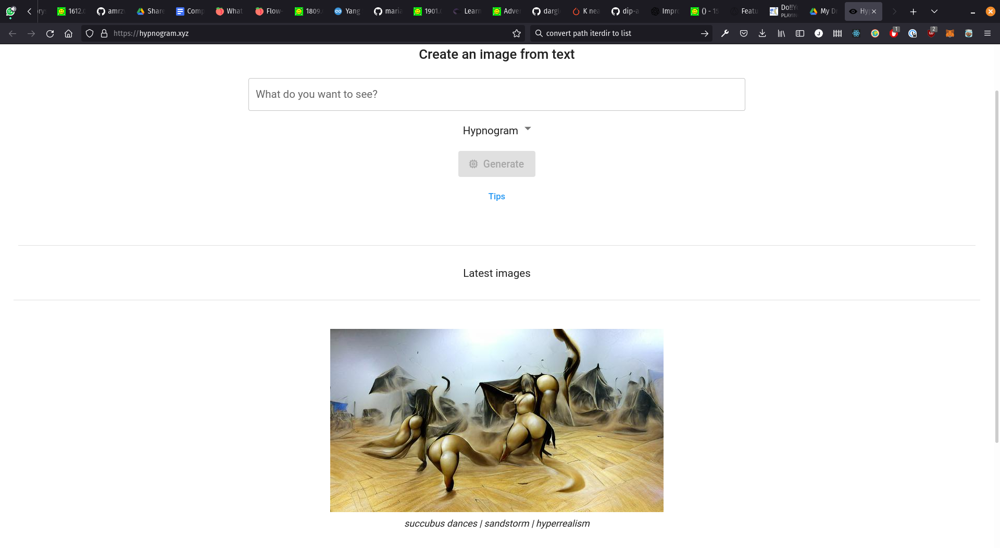

# Text Prompts

Machine learning and the study of human language have gone hand-in-hand from day one; the broader field of study is [Natural Language Processing](https://en.wikipedia.org/wiki/Natural_language_processing) (__NLP__). The amazing thing about machine learning (to me) is the cross-breeding of ideas as fundamentally ML is always about compressing highly complex information (like language, images, audio or anything else we humans enjoy) down to some abstract representation and then pouring it through some big complicated matrix calculator to try and learn from it. We are seeing more and more is that we can often treat many different types of data in the same way and see good results. SO, what I'm trying to say is that in their abstract forms, _image_ and _language_ aren't actually that different.

[OpenAI](https://openai.com/) are pretty much famous for training really massive models which, is partly showing off, but it's also partly a big effort to understand if just having a huge amount of data is enough to _infer_ more information than is at first glance. For exmaple in July 2020 OpenAI released the landmark paper [_Language Models are Few-Shot Learners_](https://arxiv.org/pdf/2005.14165.pdf) where they explore this idea stating that:

>  ...humans can generally perform a new language task from only a few examples or from simple instructions...

In the paper they show that simply training a massive language model __GPT-3__, _unsupervised_, on loads of text is enough for the model to learn how to do a number of _different tasks_:

> For all tasks, GPT-3 is applied without any gradient updates or fine-tuning, with tasks and few-shot demonstrations specified purely via text interaction with the model. GPT-3 achieves strong performance on many NLP datasets, including translation, question-answering, and cloze tasks, as well as several tasks that require on-the-fly reasoning or domain adaptation, such as unscrambling words, using a novel word in a sentence, or performing 3-digit arithmetic. 

This particular work led to things like [GitHub Copilot](https://copilot.github.com/) as suddenly it seemed that these models were useful for _anything_ that contained text, not just translation or finishing a sentence.

Later in January 2021 OpenAI released [CLIP: Contrastive Language-Image Pre-training](https://openai.com/blog/clip/). This work is highly related as they applied the same logic to a new (massive) dataset - image/caption pairs. The internet is awash with images and their captions, think of Flikr/Facebook/Instagram and the image descriptions or even the [alt text](https://www.w3schools.com/tags/att_img_alt.asp) for images online for people who use screen readers - so the dataset was easy to make. CLIP is a nifty architecture which encodes the text and image seperately, but in such a way that the encoded representations can be meanigfully compared. This allows you to train a model to predict the caption of a given image. _But_ it also means you can predict how likely a given caption is to be paired with an image... a subtle different but one which has led to a-whooole-nother explosion of crazy work.

If you can find out how like an image is to be paired with a caption, you could then optimise (change) the image over time to get a better score on the image/caption match.

> “cyborg dragon with neopixels” - [source](https://learn.adafruit.com/generating-ai-art-with-vqgan-clip)

So you need some generative model to generate an image, a sentence _describing what you want to see in the image_, and then CLIP to compare the two. CLIP will give you some numerical representation of how well matched the image and the text are. You can use this score to inform the generator how it should change the image (to improve the score). This process will differ slightly depending on what generator you are using.

> Generative Model + CLIP architecture - [source](https://ml.berkeley.edu/blog/posts/clip-art/)

But there's one more way of doing this as seen in the the third notebook, and that is to take the [Deep Dream](https://en.wikipedia.org/wiki/DeepDream) approach which is to directly optimise the _image itself_. In a nutshell, Deep Dream works by optimising the input image to a _classification_ model in order to increase the activation of a particular neuron in the network. You can take a similar approach with CLIP by directly optimising the image to improve the CLIP caption score. No one method is better than the other, they just all have different aesthetic qualities.

Any way, have a play, make some GIFs... make mad crypto-cash selling NFTs if you want!

---

# Your Turn!

[Go to **hypnogram.xyz** and have a play with CLIP](https://hypnogram.xyz/). This will help you get a feel for it (without rinsing your Colab free-GPU-time). See what you can come up with. Try and re-create some images you have seen. Does the same prompt create the same image every time?

Then work through the notebooks in this repo. The first one isn't very interesting, it's just playing with CLIP in it's bare form. But might help you understand what CLIP actually does. The next two are much more fun... The notebooks have been made by some very active people in the CLIP/Twitter/Colab ML scene ([@eps696](https://twitter.com/eps69r), [@deKxi](https://twitter.com/deKxi), [@RiversHaveWings](https://twitter.com/RiversHaveWings), [@jonathanfly](https://twitter.com/jonathanfly), [@eduwatch2](https://twitter.com/eduwatch2), [@advadnoun](https://twitter.com/advadnoun), and others) who are kind enough to share they're amazing notebooks for free.
