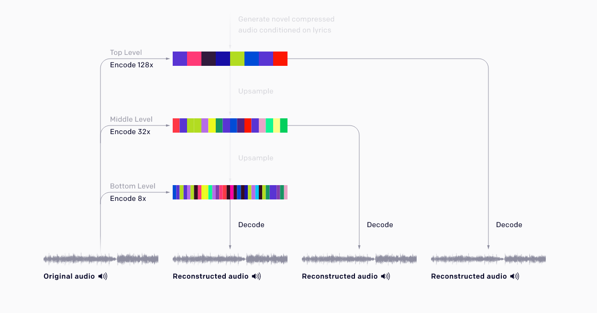
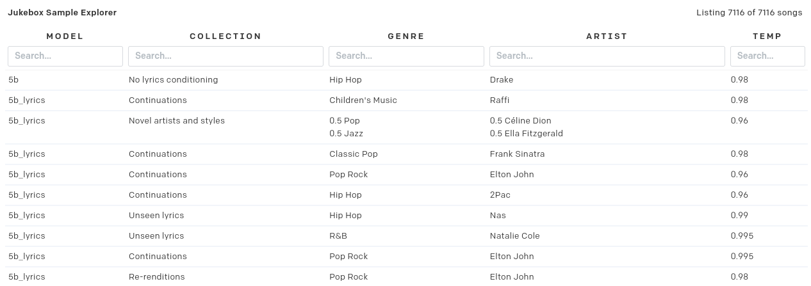

# JUKEBOX!

> 'Boris Johnson losing the plot singing Christmas carols'

---

As ever copy the link for the `.ipynb` file above and head over to [colab.research.google.com](https://colab.research.google.com/) and do the _search-for-a-Github-repo_ thing. Better instructions [here](https://github.com/joshmurr/dip-ai-comp-futures).

---

We are going to have a play with Jukebox which is another mega massive pretrained model from Open-AI. Jukebox is a [VQ-VAE]() (which is proving to be a very versatile model, it is often also used with CLIP to generate images, like the one above). Open-AI do some clever stuff like training at different resolutions to learn high, medium and low level features of the music.

They also do some clever stuff to lean _long range dependancies_ in the music. Although a single song isn't necessarily long '_a typical 4-minute song at CD quality (44 kHz, 16-bit) has over 10 million timesteps. For comparison, GPT-2 had 1,000 timesteps_', so that's a long of information packed in to a small space and there needs to be some coherence across the whole generated song. [Read more about Jukebox here](https://openai.com/blog/jukebox/).

Jukebox was also conditioned on genres and lyrics which you can use at generation time! So you can provide lyrics and a particular artist to generate you're own music in a particular style. Have a look at the [_the Jukebox Sample Explorer_](https://jukebox.openai.com) to see what genres and artists you can play around with.

You can also supply you're own lyrics, which is fun and maybe you're a natural poet, [but why not use GPT-2 to generate some Christmas carols lyrics??](https://transformer.huggingface.co/doc/gpt2-large)

This is a bit of a slow process, but it's Christmas and there's not rush so... :christmas_tree: :santa:
