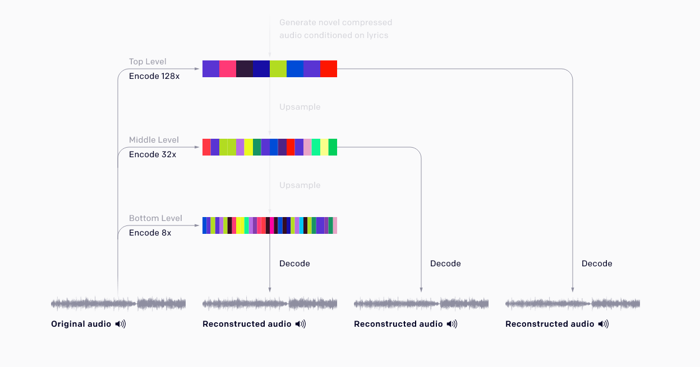
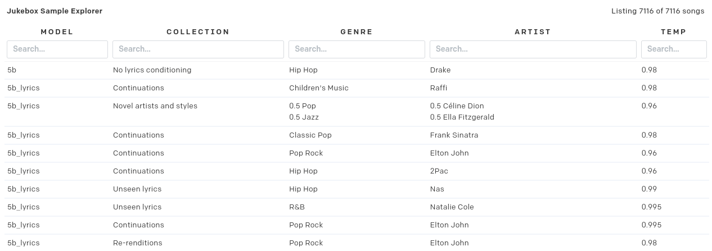

# Audio

## Jukebox

We are going to have a play with Jukebox which is another mega massive pretrained model from Open-AI. Jukebox is a [VQ-VAE]() (which is proving to be a very versatile model, it is often also used with CLIP to generate images). Open-AI do some clever stuff like training at different resolutions to learn high, medium and low level features of the music.

They also do some clever stuff to lean _long range dependancies_ in the music. Although a single song isn't necessarily long '_a typical 4-minute song at CD quality (44 kHz, 16-bit) has over 10 million timesteps. For comparison, GPT-2 had 1,000 timesteps_', so that's a long of information packed in to a small space and there needs to be some coherence across the whole generated song. [Read more about Jukebox here](https://openai.com/blog/jukebox/).

Jukebox was also conditioned on genres and lyrics which you can use at generation time! So you can provide lyrics and a particular artist to generate you're own music in a particular style. Have a look at the [_the Jukebox Sample Explorer_](https://jukebox.openai.com) to see what genres and artists you can play around with.

You can also supply you're own lyrics, which is fun and maybe you're a natural poet, [but why not use GPT-2 to generate some Christmas carols lyrics??](https://transformer.huggingface.co/doc/gpt2-large)

---

## Audio Reactive StyleGAN2

[This notebook](./StyleGAN2_AudioReactive.ipynb) allows you to generate an interpolation video using StyleGAN2 which is synced to audio. This is very cool, and pretty much what Mario Klingemann is doing here:

I'd recommend giving it a go with a shorter audio snippet first to get a feel for how it behaves with audio. It's a _relatively_ naive implementation in that is just picks two latent vectors (two faces) and uses the volume of the audio to control the interpolation between them. Once you get a feel for it you could try generating a slightly longer video (but I wouldn't go longer than a minute, given the constraints of Colab). Or maybe try using your own music, or generating some audio for it??

---

## Accent Conversion

[This notebook](./YourTTS_zeroshot_TTS_demo.ipynb) allows you to upload some audio of you speaking (or of someone else) and find out what you would sound like if you could speak French or Brazilian Portuguese. It captures the "essence" of your voice, so to speak, and then can pass than on to _new audio_ in another language and play it back to you.
