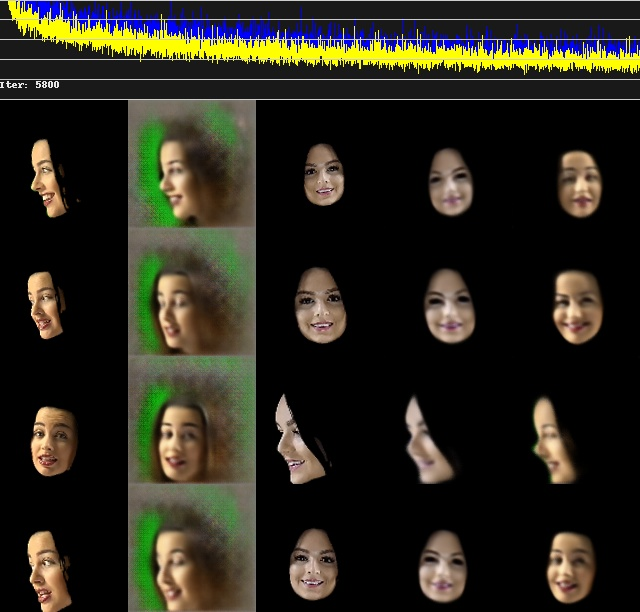

# DeepFakes

[](https://www.youtube.com/watch?v=KHMNPjkd5-0)

---

[**When seeing is no longer believing**](https://edition.cnn.com/interactive/2019/01/business/pentagons-race-against-deepfakes/) is a good article from CNN about DeepFakes and contains lots of sample videos and breif explanations.

---

It goes without saying that DeepFakes caused, and continue to cause, a lot of panic and worry about what this technology could get used for - or is already being used for. I'm not going to go down that rabbit hole of ethics.. That's something for you to think about. But the fact remains that DeepFakes are here and the technology is considered pretty well understood now.

In short a DeepFake works by learning the underlying structure of two different faces by way of an Autoencoder model. But rather than decoding that compressed version back into the original face, the compressed latent vectors are swapped, so one face (including it's pose and facial expression) is decoded into the _other_ face. You can roughly see in the diagram below from the [DeepFaceLab paper](https://arxiv.org/pdf/2005.05535.pdf) that the _target_ face and the _destination_ face are encoded by the same encoder, but the _decoded_ by the opposite decoder.. id the source face goes into the destination decoder and vice versa. The is an adverserial element to the training (as with a GAN) which just improves image quality.


In order for this to work there needs to be a bunch of image preprocessing where the src and dst faces are cropped and masks are formed, as you can see from the samples taken early in training below:




The idea is to match the faces as closely as possible by cropping and rotating etc. before the encoding process happens.

---

## Notebooks

### 1. [Official DeepFaceLab Colab Notebook](https://colab.research.google.com/github/chervonij/DFL-Colab/blob/master/DFL_Colab.ipynb)

DeepFaceLab wrote the paper mentioned above and have created some DeepFake software to make this deceptive stuff even easier! The best place to find out more in [on their Github](https://github.com/iperov/DeepFaceLab).

The notebook does it all the long and proper way.. And as I'm sure you've realised by now working with high quality images or video is a slow process with machine learning. It's fiddly to set up (lots of data prep) and slow to run... But not that bad, I went through the process and trained for about an hour which is long enough to see results. But if you want to make a convincing deepfake that'll spark some new consipiracy theory in the depths of a Telegram based counterculture... you might need to wait a bit longer.

Here are some tips for getting it all setup:

1. A lot of the cells are grouped together and collapsed, make sure to expand the cells and run them one by one, don't try and run a batch at once.
2. After running the cell titles **Install or update DeepFaceLab**, you may need to press the **Restart Runtime** button.
3. You need a **source** video (the puppeteer), and a **destination** video (the face to be manipulated). I recommend finding these online, or recording some, uploading to your drive and then copying them over to the Colab session. The files need to be in the following locations and have the correct names:

    - `/content/workspace/data_dst.mp4`
    - `/content/workspace/data_src.mp4`

4. The section **Extract, sorting and faceset tools** is a bit slow, its the data preparation stage. Each cell often has some options about image size/format/type/etc. which you will need to choose options for. It's not obvious on Colab, but sometimes you can enter values into the _output_ section of the cell, you will see this again at the end of the notebook when you come to train the model:

    

    The settings I used for the final training cell are as follows:

    ```
    ================= Model Summary =================
    ==                                             ==
    ==            Model name: murr_SAEHD           ==
    ==                                             ==
    ==     Current iteration: 100                  ==
    ==                                             ==
    ==--------------- Model Options ---------------==
    ==                                             ==
    ==            resolution: 128                  ==
    ==             face_type: head                 ==
    ==     models_opt_on_gpu: True                 ==
    ==                 archi: liae-ud              ==
    ==               ae_dims: 256                  ==
    ==                e_dims: 64                   ==
    ==                d_dims: 64                   ==
    ==           d_mask_dims: 22                   ==
    ==       masked_training: True                 ==
    ==       eyes_mouth_prio: False                ==
    ==           uniform_yaw: False                ==
    ==         blur_out_mask: False                ==
    ==             adabelief: True                 ==
    ==            lr_dropout: n                    ==
    ==           random_warp: True                 ==
    ==      random_hsv_power: 0.0                  ==
    ==       true_face_power: 0.0                  ==
    ==      face_style_power: 0.0                  ==
    ==        bg_style_power: 0.0                  ==
    ==               ct_mode: none                 ==
    ==              clipgrad: False                ==
    ==              pretrain: False                ==
    ==       autobackup_hour: 1                    ==
    == write_preview_history: True                 ==
    ==           target_iter: 100                  ==
    ==       random_src_flip: False                ==
    ==       random_dst_flip: True                 ==
    ==            batch_size: 8                    ==
    ==             gan_power: 0.0                  ==
    ==        gan_patch_size: 16                   ==
    ==              gan_dims: 16                   ==
    ==                                             ==
    ==---------------- Running On -----------------==
    ==                                             ==
    ==          Device index: 0                    ==
    ==                  Name: Tesla P100-PCIE-16GB ==
    ==                  VRAM: 14.61GB              ==
    ==                                             ==
    =================================================
    ```

    The main one is `target_iter` which refers to the **total number of iterations**, you can train for a few and then continue training. Each iteration in this case does not take too long so here I trained for 100 iterations to make sure it all worked, and then ran it again with 10,000 iterations.

### 2. [First Order Motion Model for Image Animation Colab Notebook](https://colab.research.google.com/github/AliaksandrSiarohin/first-order-model/blob/master/demo.ipynb)

This notebook is the demo to go alongside [this research](https://aliaksandrsiarohin.github.io/first-order-model-website/) under the name above. This work has the capacity to apply the same principles of deepfakes but to full figure animation and even cartoon animation:


However the notebook is a more "user friendly" version which just means its not as powerful, but you get results quicker. They have injected a bunch of HTML and CSS into the notebook which makes a GUI thing at the bottom. There are only a couple cells to run, so once the GUI appears at the bottom you can upload an image to be manipulated, and choose or upload a video file to be the puppeteer, if you will. The video needs to be a fairly specific format however, so doesnt always work.

### 3. [Wav2Lip](https://colab.research.google.com/github/eyaler/avatars4all/blob/master/melaflefon.ipynb#scrollTo=P3LihClHbUd3)

This is a good compromise between the two above! Fairly easy to use, fairly quick, but the results are not magnificent. This notebook allows you to choose from a selection of audio snippets and then upload a still image to animate based on the audio.
